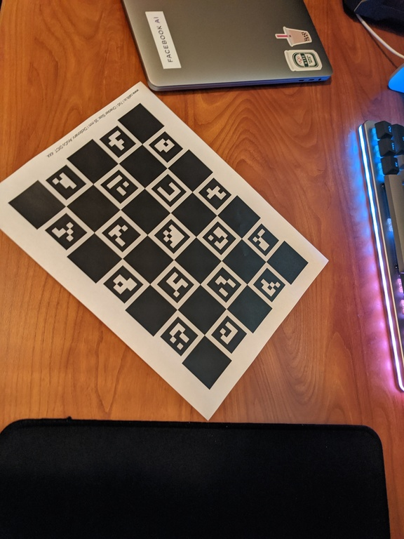
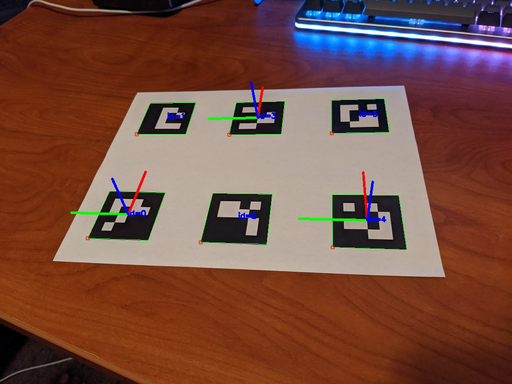

# ArUcoX

A wrapper around [ArUco](https://www.uco.es/investiga/grupos/ava/node/26) that provides a cleaner API and default parameters that work with pre-generated calibration boards and markers.
Also provides a scene API that calibrates multiple cameras in a global frame.
Performs detection and pose estimation of ARTag markers.

The source code for the API can be found at [python/arucoX](https://github.com/fair-robotics/fair-aruco/blob/master/python/arucoX)

## Requirements
Python:
- numpy
- opencv-contrib-python

C++: To be supported

## Installation
```
git clone git@github.com:facebookresearch/fairo.git
cd fairo/arucox
pip install .
```

## Camera-Centric Usage

Example can be found in [examples/single_camera](https://github.com/fair-robotics/fair-aruco/blob/master/examples/single_camera)

### Creating Markers

The calibration board can be found in `resources/calib.io_charuco_215.9x279.4_7x5_35_DICT_4X4.pdf`.

Some sample markers are given in `resources/markers`.

Additional markers can be generated [here](https://chev.me/arucogen/).

### Camera Calibration
Calibration can be performed by printing the provided calibration board pdf on a letter paper (8.5" x 11"), then taking photos of the calibration board from different angles. 
As seen in the example, calibration can be performed even if the calibration board partially occluded in the images.

<p align="center">
  
  
  
  
  
</p>

```py
import arucoX as ax

c = ax.CameraModule()
c.calibrate_camera(calib_img_list)
```

`calib_img_list`: list of images of the calibration board taken from different angles.

Camera calibration parameters can also be saved/loaded by:
```py
# Loading from matrices
c.set_intrinsics(matrix=matrix, dist_coeffs=dist_coeffs)  # matrix: 3x4, dist_coeffs: 5x1

# Saving/loading from a CameraIntrinsics object
params = c.get_intrinsics()
c.set_intrinsics(params)

# Saving/loading from file
c.save_intrinsics(filename)
c.load_intrinsics(filename)
```
(`params` is a dictionary containing fields `"camera_matrix"` and `"distortion_coeffs"`.)

(NOTE: Calibration with checkerboard is buggy. Importing intrinsics from the camera driver is recommended.)

### Marker Detection
Input image `img`:
<p align="center">
  
</p>

```py
# Register marker lengths to enable pose estimation of corresponding markers
c.register_marker_size(0, MARKER_LENGTH)
c.register_marker_size(3, MARKER_LENGTH)
c.register_marker_size(4, MARKER_LENGTH)

# Perform detection and pose estimation
markers = c.detect_markers(img)
```

`MARKER_LENGTH`: Width of the printed markers.

`markers`: A list of `MarkerInfo` - a NamedTuple containing the following fields:
- `id`: Marker ID
- `corner`: Image coordinates of the four corners of the marker 
- `length`: Marker length (`None` if marker not registered)
- `pose`: Transformation of the marker in the camera frame expressed using [sophus](https://pypi.org/project/sophuspy/).SE3  (`None` if marker not registered)

Note: The following helper functions are provided to translate `sophus.SE3` into quaternions:
```py
import sophus as sp

t = sp.SE3()

quat = ax.utils.so3_to_quat(t.so3())      # array([0., 0., 0., 1.])
pos, quat = ax.utils.se3_to_pos_quat(t)   # array([0., 0., 0.]), array([0., 0., 0., 1.])
```

### Rendering Results

Identified markers and their estimated poses can also be rendered on the input image for visualization and debug purposes.

```py
# [Option 1] Detect and render markers on image
img_rend = c.render_markers(img)

# [Option 2] Save computation time by providing previous output from "detect_markers"
img_rend = c.render_markers(img, markers)
```
Output image `img_rend`:
<p align="center">
  
</p>

### Notes
- More precise measurements of the marker length will result in better pose estimations.
- Markers require white spaces around them to be detected.

## Scene-Centric Usage (with multiple cameras)

```py
import arucoX as ax 

# Initialize camera modules
c1 = CameraModule()
c2 = CameraModule()
c3 = CameraModule()

# Initialize scene module
scene = ax.Scene(cameras=[c1, c2, c3])

# Register markers
TABLE_MARKER_ID = 0
TABLE_MARKER_LENGTH = 0.1
OBJECT_MARKER_ID = 1
OBJECT_MARKER_LENGTH = 0.04

scene.register_marker_size(TABLE_MARKER_ID, TABLE_MARKER_LENGTH)
scene.register_marker_size(OBJECT_MARKER_ID, OBJECT_MARKER_LENGTH)
scene.set_origin_marker(TABLE_MARKER_ID)

# Calibrate extrinsics (move object around in different snapshots
scene.add_snapshot(imgs0)  #imgs: list of imgs corresponding to captures from each camera
scene.add_snapshot(imgs1)
scene.add_snapshot(imgs2)

scene.calibrate_extrinsics()

# Visualize camera locations
scene.visualize()

# Detect markers in global frame
scene.detect_markers()
```


## Todos
- Hand-eye coordination
- API for C++??
