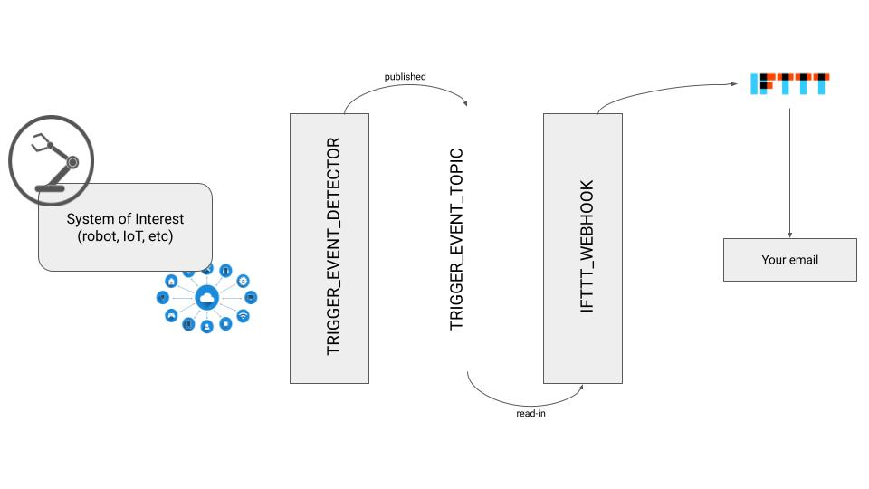

# Integrating FBRP with IFTTT

IFTTT (if-this-then-that) is an onlline service which enables user to create 
useful workflows and alerts based on the occurrence of trigger events. This
example creates an email-alert mechanism using IFTTT when a certain event occurs
on the client-side and an EVENT_TRIGGER is published. The alerts are
configured using the `cfg` mechanism.

## System Overview


## IFTTT Account Setup

Create an account on IFTTT if you do not already have one and click "Create" on 
top-right in UI. Select a Webhooks based `if-this` trigger and choose "Receive a 
web request" `then-that` recipe on the next page. Name your event, we will refer
to this string as TRIGGER_EVENT_NAME. Next go to: 
[IFTTT Webhooks](https://ifttt.com/maker_webhooks), sign in and click 
"Documentation". The page will have your key on the top, note this down. We will
refer to this as IFTTT_KEY in this tutorial.

## Configuring `ifttt.py`

As it is written this script depends on three configuration parameters: 
1. IFTTT_KEY as explained above
2. TRIGGER_EVENT_NAME as explained above
3. TRIGGER_EVENT_TOPIC: Name of the `alephzero` topic which publishes a message
when TRIGGER_EVENT_NAME has been detected on client-side

Input your specific strings for the parameters specified above in `fsetup.py`
on lines 3, 4 and 5.

## Running the scripts

```
fbrp up 
```

Verify that you're getting an email every 10 seconds

## Running with `a0` CLI

```
fbrp up ifttt_webhook
```

and then publish explicitly to your TRIGGER_EVENT_TOPIC: 
```sh
a0 pub TRIGGER_EVENT_TOPIC True 
```

Verify you received an email from IFTTT