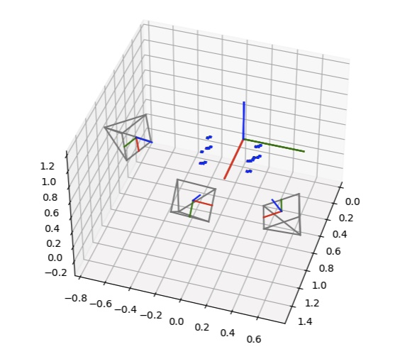

# Eye Hand Calibraton 
A minimal version of eyehand calibration feature for a franka + realsense setup. With a marker attached to end effector of a robot, the tool controls the robot via polymetis and collect marker keypoint on multiple cameras simultaneously and finally outputs

## Settings
  ### world camera and hand marker  (default)
  * the camera poses in robot base frame
  * the marker position in robot end-effector frame

  ### hand camera and world marker 
  * the camera poses in robot end-effector frame
  * the marker position in robot base frame

## Prerequisite
* Using a realsense camera
  * Camera is pre-calibrated / intrinsic parameter can be read from system
  * Camera image is rectified
  * Driver is available in [fairo/perception/realsense_driver](https://github.com/facebookresearch/fairo/tree/main/perception/realsense_driver)
* You have a ARTag available in hand 
  * please use `4x4_50` family or change [code](https://github.com/facebookresearch/fairo/blob/9ad466122e1e0674080a6a13ecbb00046978eaa5/perception/sandbox/eyehandcal/src/eyehandcal/utils.py#L11)
  * ARTag marker size does not matter (only for keypoint identification)
  * Generate one here https://chev.me/arucogen/
  * Wrapper is available in [fairo/perception/fairotag](https://github.com/facebookresearch/fairo/tree/main/perception/fairotag)
* [Polymetis](https://facebookresearch.github.io/fairo/polymetis/) is available to control the robot.

## Coordinate Frame Transformations

* World origin is aligned with Robot Base (x-forward, z-up)
* Camera coordinate is z_point forward, x right, y down
* Paramterizetion [rx, ry, rz, x, y, z, px, py, pz]
  * camera-to-base rotvec (rx, ry, rz)
  * camera-to-base translation (x, y, z)
  * marker-to-ee translation (px, py, pz)


## Setup

```bash
conda env create -f environment.yml
conda activate eyehandcal  # or direnv allow
pip install -e .
```


  
## Usage

### Define workspace and orientations

First, we define the workspace from which we sample end-effector poses to get our data.

To do this, first put the Franka Panda robot in manual control mode (white-colored, activation device off).
Run Polymetis in read-only mode:
```bash
launch_robot.py robot_client=franka_hardware robot_client.executable_cfg.readonly=true
```
You may move the end-effector around by lightly pressing on the two buttons on the wrist and dragging the robot around.
Polymetis will return the current state but otherwise will not control the robot.

Then, run the script `record_calibration_points.py`. This lets you manually select (1) the _M_ points whose convex hull define the workspace the calibration script will sample from, and then (2) the _N_ end-effector orientations the robot will run through for each point. The cameras' images and ARTag will be visualized at each point -- check to ensure the points cover but do not exceed the workspace. _M_ should be around 8 to cover the corners of the volume, while _N_ can be 2-3 orientations per point.

This will output `calibration_points.json`, which defines the workspace (`xyz` points, as well as `quat` orientations).

```bash
record_calibration_points.py --help
usage: record_calibration_points.py [-h] [--ip IP] [--marker-id MARKER_ID] [--marker-length MARKER_LENGTH]

optional arguments:
  -h, --help            show this help message and exit
  --ip IP               robot ip address
  --marker-id MARKER_ID
                        ARTag marker id
  --marker-length MARKER_LENGTH
                        ARTag length in meters
```

### Run calibration

Run `collect_data_and_cal.py` to run the calibration process by sampling from the workspace. (Make sure Polymetis is not in read-only mode now -- the robot will move during calibration.) This will output a `calibration.json` containing `camera_base_ori`, `camera_base_pos`, and `p_marker_ee` for each camera. Useful parameters include:

- Increase the dataset size by changing the number of points sampled using `--num-points`
- Change the amount of time per movement (in seconds) using `--time-to-go`
- Visualize the output images by providing an `--imagedir`.

```bash
$ collect_data_and_cal.py --help
usage: collect_data_and_cal.py [-h] [--seed SEED] [--ip IP] [--datafile DATAFILE] [--overwrite] [--marker-id MARKER_ID] [--calibration-file CALIBRATION_FILE] [--points-file POINTS_FILE] [--num-points NUM_POINTS]
[--time-to-go TIME_TO_GO] [--imagedir IMAGEDIR] [--pixel-tolerance PIXEL_TOLERANCE] [--proj-func {hand_marker_proj_world_camera,world_marker_proj_hand_camera}]

optional arguments:
  -h, --help            show this help message and exit
  --ip IP               robot ip address
  --datafile DATAFILE   file to either load or save camera data
  --overwrite           overwrite existing datafile, if it exists
  --marker-id MARKER_ID
                        ID of the ARTag marker in the image
  --calibration-file CALIBRATION_FILE
                        file to save final calibration data
  --points-file POINTS_FILE
                        file to load convex hull to sample points from
  --num-points NUM_POINTS
                        number of points to sample from convex hull
  --time-to-go TIME_TO_GO
                        time_to_go in seconds for each movement
  --imagedir IMAGEDIR   folder to save debug images
  --pixel-tolerance PIXEL_TOLERANCE
                        folder to save debug images
  --proj-func {hand_marker_proj_world_camera,world_marker_proj_hand_camera}
  ```
  
Proper convergence should have very small loss (i.e., < 5).
A good loss is < 1, such as 
```
found param loss (mean pixel err) 0.5735991334330837
```
A larger loss indicate 
* premature convergence 
* poor camera intrinsics calibration.
* inaccurate robot forward kinematics
* temporal misalignment between image and robot kinematics capture

##  Sample Run (world camera hand marker setting)
```
$ collect_data_and_cal.py 
Config: Namespace(calibration_file='calibration.pkl', datafile='caldata.pkl', imagedir=None, ip='100.96.135.68', overheadcam=False, overwrite=False, target_marker_id=9)
Collecting data and saving to caldata.pkl...
Moving to pose (0): pos=tensor([ 0.3000, -0.2000,  0.2000]), quat=tensor([ 7.0711e-01, -7.0711e-01,  3.0909e-08, -3.0909e-08])
The specified 'time_to_go' might not be large enough to ensure accurate movement.
Current pose  pos=tensor([ 0.3123, -0.2040,  0.2131]), quat=tensor([ 0.7344, -0.6730, -0.0874, -0.0117])
Connecting to RealSense cameras (3 found) ...
Connected to camera 1 (134322072090).
Connected to camera 2 (819612070332).
Connected to camera 3 (745412070129).
Moving to pose (1): pos=tensor([ 0.3000, -0.2000,  0.2000]), quat=tensor([ 9.2388e-01, -3.8268e-01,  1.6728e-08, -4.0384e-08])
The specified 'time_to_go' might not be large enough to ensure accurate movement.
Current pose  pos=tensor([ 0.3154, -0.2029,  0.2143]), quat=tensor([ 0.9079, -0.4119, -0.0708, -0.0334])
Moving to pose (2): pos=tensor([ 0.3000, -0.2000,  0.2000]), quat=tensor([ 1.0000e+00,  0.0000e+00,  0.0000e+00, -4.3711e-08])
The specified 'time_to_go' might not be large enough to ensure accurate movement.
Current pose  pos=tensor([ 0.3161, -0.2017,  0.2141]), quat=tensor([ 0.9963, -0.0356, -0.0533, -0.0571])

[ommited]

Moving to pose (23): pos=tensor([0.5000, 0.2000, 0.4000]), quat=tensor([ 1.0000e+00,  0.0000e+00,  0.0000e+00, -4.3711e-08])
The specified 'time_to_go' might not be large enough to ensure accurate movement.
Current pose  pos=tensor([0.4880, 0.1900, 0.3722]), quat=tensor([ 0.9944, -0.0364,  0.0755, -0.0638])
Done. Data has 24 poses.
Solve camera 0 pose
number of images with keypoint 16
found param loss (mean pixel err) 0.5735991334330837
Solve camera 1 pose
number of images with keypoint 18
found param loss (mean pixel err) 0.5239134212798963
Solve camera 2 pose
number of images with keypoint 24
found param loss (mean pixel err) 0.4858614196985962
Camera 0 calibration: {'camera_base_ori': [[0.892033592986941, 0.22903549165466466, -0.3896393364963453], [0.4465006462356902, -0.5802683997213952, 0.681120956362292], [-0.07009452114050763, -0.7815569895070216, -0.6198834005349755]], 'camera_base_pos': [0.8072452010515013, -0.6036077776313639, 0.6805924802831862], 'p_marker_ee': [0.0023192721415406757, -0.027087546305586668, 0.04246972551760114]}
Camera 1 calibration: {'camera_base_ori': [[0.6920654327549511, -0.020601643047435576, -0.7215407189406902], [-0.7217609162879942, -0.03404871555355593, -0.691304465983165], [-0.010325526854236884, 0.9992078148578003, -0.0384333998272775]], 'camera_base_pos': [0.8874392156675477, 0.5691641057262715, 0.19321902596391374], 'p_marker_ee': [0.0018645033534617275, -0.025769377944437892, 0.04821359113637325]}
Camera 2 calibration: {'camera_base_ori': [[0.07010687759684431, 0.48682681778084386, -0.8706805816158982], [0.9973054134708029, -0.015298818452680739, 0.07174857779623775], [0.021608747660427696, -0.8733645262107508, -0.4865875731882376]], 'camera_base_pos': [1.26078606848007, -0.0031604314503920323, 0.5551140747234479], 'p_marker_ee': [0.0012896360615638498, -0.027861485398250726, 0.047117261120020175]}
Saving calibrated parameters to calibration.pkl
```


## Development
* See [jupyter notebook](visualize_cal.ipynb) to understand how the internal works.
* use `tests/make_test_data.py` to create compressed datafile for testing.


## Future Work
* ARTag based Intrinsic calibration
* Detect poor convergence case and automatic recovery


