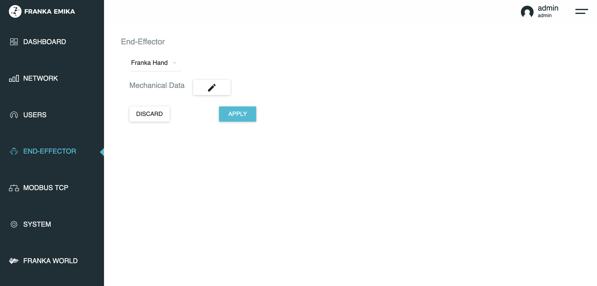

# Troubleshooting

## Cannot connect to Franka Robot

Refer to libfranka docs [here](https://frankaemika.github.io/docs/troubleshooting.html#running-a-libfranka-executable-fails-with-connection-timeout).


## Motion stopped due to discontinuities or `communication_constraints_violation`

The robot expects a command from the controller every millisecond. If the robot fails to receive a command packet in time for 20 steps in a row, this error is triggered and the robot stops operation for safety considerations. Common reasons include:
1. The CPU not being able to compute the controller outputs in time.
2. The network not being able to transfer the commands in time.

### CPU performance (of the NUC)

First, confirm that the system is correctly running a real-time kernel:
1. The output of `uname -a` should contain the string `PREEMPT_RT`.
2. `/sys/kernel/realtime` should exist and contain the number `1`.

Then, follow instructions to [disable CPU frequency scaling](https://frankaemika.github.io/docs/troubleshooting.html#disabling-cpu-frequency-scaling).

It is recommended to have a minimum CPU spec of an 8th gen i7 processor to control a Franka robot with Polymetis.

### Networking (between the NUC and the robot)

Run the simple ping test and the `communication_test` as documented in the libfranka docs [here](https://frankaemika.github.io/docs/troubleshooting.html#running-a-libfranka-executable-fails-with-connection-timeout). The `communcation_test` command is installed with Polymetis and should be directly accessible in the command line.

### End-to-end testing

To test real-time performance, start a polymetis server connected to a fake Franka robot with 
```bash
launch_robot.py robot_client=franka_hardware robot_client.executable_cfg.mock=true
```

Then run 
```bash
benchmark_control_latency.py
```
to measure statistics of the control loop time. 
Example output:
```txt
Control loop latency stats in milliseconds (avg / std / max / min):
Joint PD: 0.2243/ 0.0932 / 4.1315 / 0.1522
Cartesian PD: 0.3051/ 0.1358 / 5.9305 / 0.1383
```
The average should be well below 0.5 milliseconds in order to run on Franka hardware.


## Inaccurate tracking performance

### End-effector configuration

The gravity compensation onboard the Franka Robot relies on an accurate end-effector configuration within Desk, which can be accessed at Settings > End-Effector: 
Desk provides configurations for the Franka Hand and for when no gripper is attached. 
If you have a different gripper, or have force torque sensors or adapters installed, then you will need to supply the inertia fields using the end-effector type "Other".
