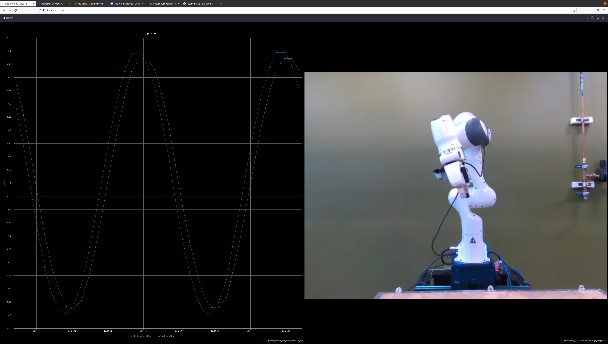
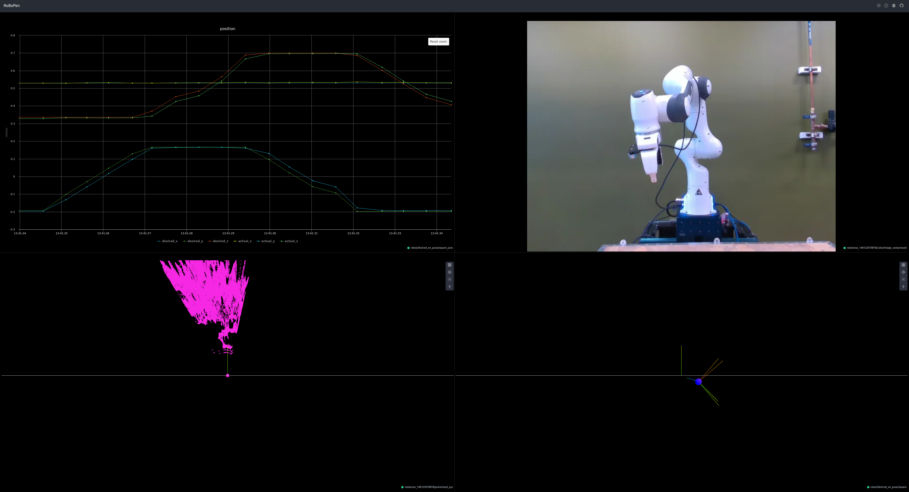

# RoBoPen UI Examples

Run the [RoBoPen UI](https://github.com/fairinternal/robopen) either locally or through the [demo site](https://robopen.dev.metademolab.com/).

On the dashboard, click the dropdown icon in the top right corner to import dashboard. Import the dashboard JSON file corresponding to the script you would like to run, or feel free to configure the panels yourself.

The IP of the NUC may need to be changed, and the topics may change for the realsense cameras based on their IDs. 

Make sure you are also running the MRP processes in /robopen/perception/realsense_pub in the RoBoPen repository.

Install fairomsg according to its [readme](https://github.com/facebookresearch/fairo/tree/main/msg), or run the line below inside the robopen_dashboard_demos directory:
```
pip install git+https://github.com/facebookresearch/fairo.git@main#subdirectory=msg
```


## Sinusoidal Movement

In the sinusoidal_movement.py file, pick one of the sinusoidal or chirp functions to uncomment. Run the file and you should be able to see the desired and actual joint positions in the chirp or sinusoidal graph on the left, and a video of the arm on the right.




## Square Movement

Run the square_movement.py file. In the top left, you should see a graph of the desired and actual x, y, and z positions. In the top right, there will be a video of the arm from the realsense camera. The bottom left displays the pointcloud from the realsense camera, and the bottom right displays the pose of the end effector in 3D space.

