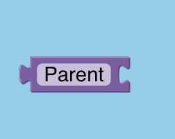

# Usage

The user can create templates by putting together puzzle-like pieces.
Each piece represents a template object, and combining them generates a template.

## Template objects

A template object is an entity capable of generating text (surface form) and an action dictionary (logical form). Logical forms are defined as per the CraftAssist spec doc. Templates are represented as single puzzle pieces in the tool.

## Templates

A template is a collection of template objects connected together. It is also a heuristic for generating surface and logical forms.

## Using the tool

### Main components

#### Blockly workspace

This is the main workspace in the tool where users drag template objects(blocks) and combine them to create templates. This is a standard Blockly workspace.

#### Searchbox

This box is where users can search for templates and template objects by name or tag.

#### Surface forms box

This box is where generated surface forms will populate. Also, this box will be used to associate template objects with surface forms.

#### Logical form box

This box will be used to associate logical forms with template objects.

#### Generations box

This box will contain generated surface-logical forms for templates and template objects.

#### Highlight button

This button is used to highlight spans and categorical values.

#### Save changes button

Used to save changes in generated surface forms for templates.

#### Generate code button

Used to generate logical and surface forms for a template or template object.

### Creating template objects

1. Drag one of the `template object` into the Blockly workspace.

2. Write the name of the template object into the editable box on the block.

3. Write the surface forms to be associated with this template object in the box labelled `surface forms`. Each surface form must be newline separated.

4. Write a single logical form in the box labelled `Enter logical forms`. It must not contain single quotes.

5. Right click on the block and choose `save by name`. The block is now available in the search box. The name must not contain spaces.

6. You may also tag the block using the `save by tag` option. Tags may be shared by multiple blocks. The name must not contain spaces.

### Assigning parents to template objects

1. Drag a `parent` into the workspace.
   

2. In the editable text box, write the name of a spec doc element `(eg:reference_object)`. The generated dictionary for the template object connected to the parent block will then be wrapped in `{reference_object:{1}}`. The generated dictionary by the template object will replace 1.

3. To specify more levels, type in a "." seperated string in the editable text box.

4. If two blocks don't have a parent they are at the same level.

### Creating templates

1. Simply combine blocks to create templates by plugging them into each other.

2. You can save and tag templates the same way as template objects.

### Generating from templates

Click on `generate code` to generate surface-logical form pairs for templates.

### Dictionary formation

1. The template is traversed left to right.

2. If a parent is specified, the dictionary is wrapped in its parents.

3. The skeletal is checked for the existence of a path/subpath that contains the keys that the template object generates. If such a path exists, follow the path as deep as possible and then plug in the code for the template object.

### Correcting surface forms for templates

1. First, generate from the template and save the template.

2. Edit surface forms in place and click on `save changes`.

### Random

1. For random categorical values, first create template objects for each categorical, fixing the value of the categorical in the dictionary for each template object.

2. Use the `random from list` block to random over template objects.

3. To random over template objects, write their names in the box after `random over`. The names must be `, ` seperated.

4. Write the name of the template object in the `name` box.

## Dictionary specs

For placeholders for spans, use "".

## Using the generator

1. The generator is present in `backend/generators.py`.

2. The generator automatically reads templates saved using the tool.

3. To run the generator, go to the `template_tool` folder and do

```
   cd backend/pythonGenerator
   python -m pip install nested_lookup
   python -m pip install deepmerge
   python generators.py
```
